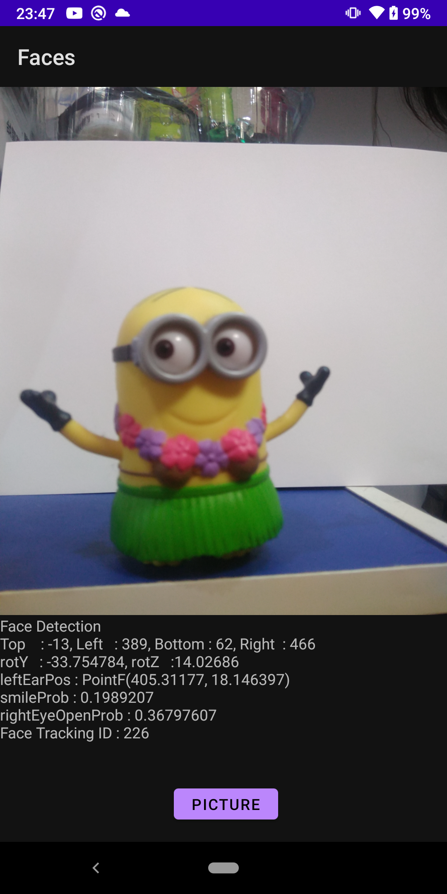

# Face Detection on Camera using ML Kit

The repository shows how to detect the face on the camera by using the MLKit and CameraX.

- Image Capture
- Image Analysis
- Face detection by using MLKit
  - Bounding boxes
  - Ear Positions
  - Smile Probability
  - Face Tracking ID

The screenshots: 

| Picture |
|--|
|  |
